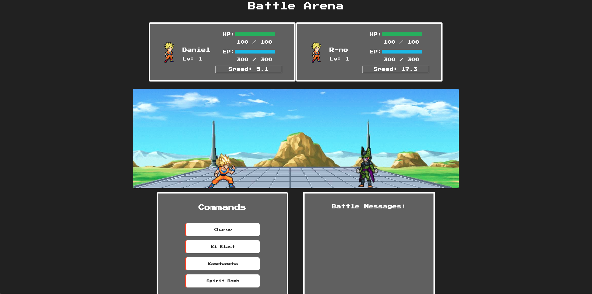

# RPGym

### Video Presentation:

`video: https://m.youtube.com/watch?v=_LZ8R1KoTeQ`

### Deployed Web App:

https://rpgym.herokuapp.com

### Description:

NES themed web app that gamifies fitness. The app allows users to create avatars based on the workout statistics recorded on their Strava accounts, and use them to battle one another. Strava is a free workout tracking app.

MVP completed using Agile methodologies in 14 days for a group project.

### Tech Stack:

Built using the NERDS stack and utilizes Socket.io and the Strava API.

### Dev Team:

- Tal Luigi ([LinkedIn](https://www.linkedin.com/in/talluigi) | [GitHub](https://github.com/luigilegion))
- Daniel Rivera ([LinkedIn](https://www.linkedin.com/in/daniel-rivera-) | [GitHub](https://github.com/driver620))
- Arnald Wong ([LinkedIn](https://www.linkedin.com/in/arnald-wong) | [GitHub](https://github.com/ArnaldWong))
- Daphne Clyne ([LinkedIn](https://www.linkedin.com/in/daphne-c) | [GitHub](https://github.com/daphne178))
